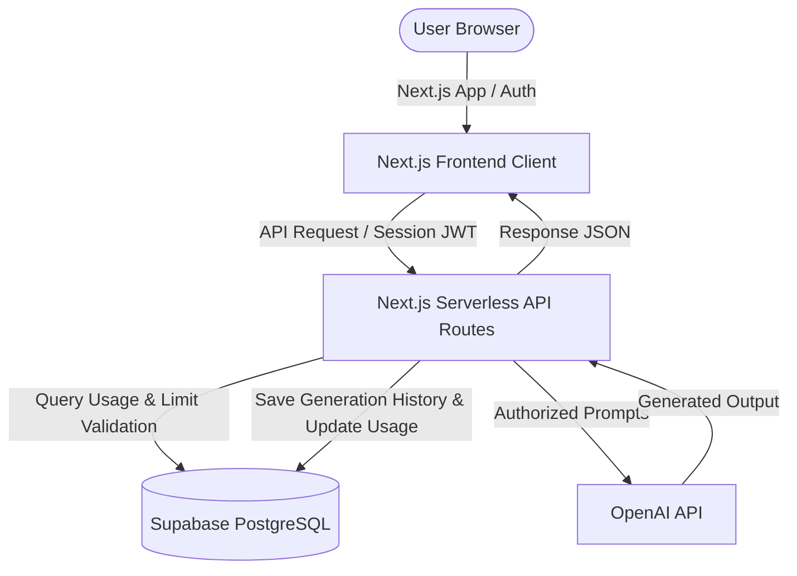
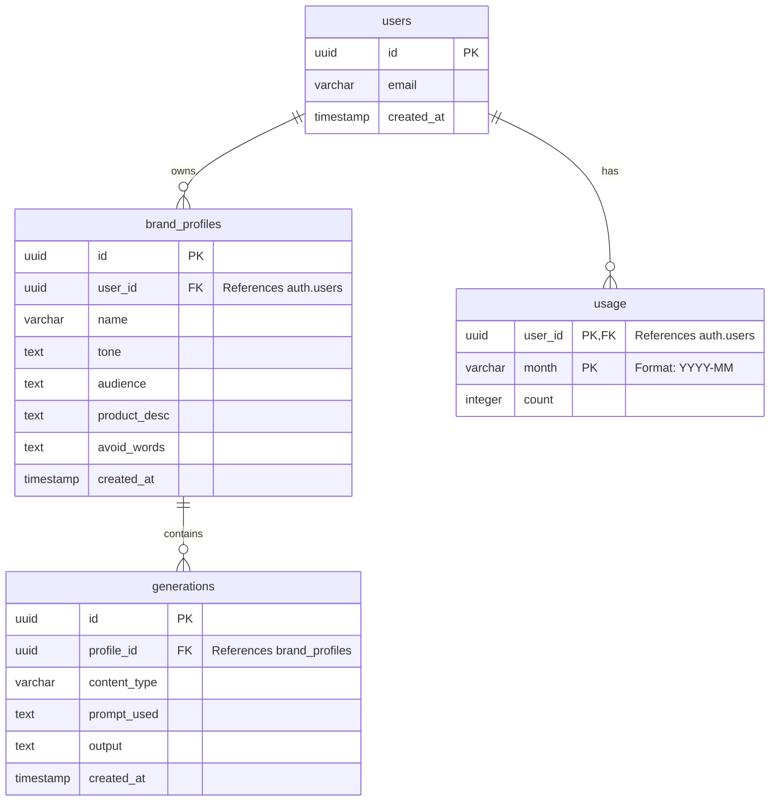
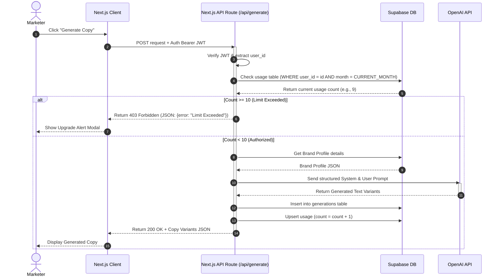

# Product Requirements Document (PRD)
## Project Name: BrandVoice – AI-Powered Brand Content Generation SaaS

---

## 1. Document Control & Metadata

| Metadata Field | Value |
| :--- | :--- |
| **Document Version** | 1.0.0 |
| **Status** | Approved / Initial Release |
| **Date** | June 17, 2026 |
| **Target Launch** | Q3 2026 |
| **Author** | Antigravity AI |
| **Target Stack** | Next.js, Supabase (PostgreSQL + Auth), OpenAI API |

---

## 2. Project Overview

**BrandVoice** is a modern SaaS platform designed to solve the "generic content" problem in generative AI. Instead of creating generic, one-size-fits-all copy, the platform learns and internalizes a business's unique brand guidelines (tone of voice, target audience, product description, and forbidden words) through a customized **Brand Profile**. 

Using these profiles, BrandVoice dynamically compiles specialized AI prompts to generate high-performing, tailored marketing assets (e.g., social media captions, ad headlines, and email sequences) that sound exactly like the brand.

### Core Value Pillars
1. **Brand Consistency**: Centralized brand voice rules applied to all generated outputs.
2. **Effortless Scale**: Generate multi-channel marketing campaigns in seconds.
3. **Usage Security**: Strict backend verification protecting AI API resources from abuse.
4. **Simplicity**: Dynamic user dashboard and template library for ease of access.

---

## 3. Problem Statement & Value Proposition

### The Problem
Traditional AI content generators operate on generic baseline models. When marketers ask them to "write an Instagram post for running shoes," they output boilerplate, cliché text. To make the text match a specific brand identity, users must repeatedly write long, complex context instructions in every single prompt. This is repetitive, error-prone, and unsustainable for scaling businesses.

### The Solution
BrandVoice introduces a "define once, apply everywhere" model. By capturing the core marketing DNA of a product or brand in a structured **Brand Profile**, the application automatically prefixes and contextualizes every generation request behind the scenes. This ensures that the generated assets consistently reflect the appropriate tone, speak directly to the target demographic, highlight the correct product benefits, and strictly avoid forbidden terms.

---

## 4. Target Personas

| Persona | Primary Needs | Key Pain Points | How BrandVoice Helps |
| :--- | :--- | :--- | :--- |
| **Small Business Owners** | Quick social media copy, simple product descriptions. | No budget for a dedicated copywriter; lack of writing experience. | Instantly drafts posts using Nike-level or premium-grade tones with minimal input. |
| **Marketing Teams & Agencies** | Consistent voice across channels; variant generation. | Keeping writers aligned on brand guidelines; creative burnout. | Centralizes brand guidelines in profiles and exports varied choices (A/B testing). |
| **Startups & Founders** | Landing page copy, pitch ideas, high-converting ad headlines. | High cost of branding agencies; speed-to-market. | Rapidly creates targeted value propositions for multiple buyer personas. |
| **Freelancers** | Multi-client content management. | Juggling 5-10 clients, each with a different brand style. | Switch profiles seamlessly and generate custom copy for client A, then client B, instantly. |

---

## 5. System Architecture & Flow

The application leverages a modern Serverless / BaaS architecture. Supabase handles authentication, data storage, and security policies, while Next.js coordinates routing, API endpoints, and client-side rendering.

### High-Level Architecture Flow



---

## 6. Functional Requirements (FRs)

### FR-1: User Authentication
*   **Description**: Users must register, authenticate, and securely log out to protect access to their brand data.
*   **Detailed Features**:
    *   Sign up via Email & Password.
    *   Sign in with session management.
    *   Password reset workflows (handled through Supabase Auth).
    *   Route Protection: Unauthorized users redirected to `/login`.
*   **Acceptance Criteria**:
    *   `POST` requests to API endpoints return `401 Unauthorized` if a valid session JWT is missing.
    *   User sessions persist across browser refreshes until explicitly logged out.

### FR-2: Brand Profile Management
*   **Description**: A CRUD system allowing users to define, view, update, and delete distinct Brand Profiles.
*   **Data Structure**:
    *   `Brand Name`: e.g., "Nike"
    *   `Tone of Voice`: e.g., "Motivational, energetic, bold"
    *   `Target Audience`: e.g., "Young athletes and fitness enthusiasts"
    *   `Product Description`: e.g., "Premium athletic shoes and apparel"
    *   `Words to Avoid`: Comma-separated list of words (e.g., "cheap, bargain, budget").
*   **Acceptance Criteria**:
    *   Users can create up to 5 brand profiles (Free Tier constraint).
    *   Data edits update immediately in Supabase and reflect on subsequent content generations.
    *   Users can only view and edit brand profiles they own (enforced by Supabase Row-Level Security).

### FR-3: Content Generation
*   **Description**: Orchestrate OpenAI API requests using a combination of the selected Brand Profile, chosen content template, and custom user input.
*   **Supported Content Types**:
    *   Instagram Caption
    *   Facebook Post
    *   Ad Headline
    *   Product Description
    *   Cold Email
    *   Marketing Copy / Call to Action (CTA)
*   **Acceptance Criteria**:
    *   The frontend exposes a selection dropdown for Brand Profiles and Content Types, along with an input text box for specific instructions.
    *   System securely validates user usage quota *prior* to sending a request to the OpenAI API.
    *   Response displays 1 to 3 distinct generation variations (A/B testing support).

### FR-4: Content Library & History
*   **Description**: A historical repository of all generated copy, allowing users to search, edit, delete, and copy outputs to their clipboard.
*   **Detailed Features**:
    *   "Copy to Clipboard" button next to all generated text.
    *   Filter generations by Brand Profile or Content Type.
    *   Delete generations from history.
*   **Acceptance Criteria**:
    *   Successful generations are automatically stored in the database.
    *   Deleted generations immediately disappear from the frontend interface and database.

### FR-5: Usage Tracking & Security Limits
*   **Description**: A server-side counter enforcing a usage limit of **10 generations per calendar month** on the Free Tier.
*   **Acceptance Criteria**:
    *   Count increments only upon successful `200 OK` completion of an OpenAI API generation.
    *   If monthly generation count reaches 10, the server rejects subsequent generation requests with `403 Forbidden`.
    *   Monthly counters reset automatically on the 1st of each month.

### FR-6: Interactive Dashboard
*   **Description**: An analytics panel summarizing account utilization.
*   **Dashboard Metrics**:
    *   Active Brand Profiles count.
    *   Total Generations history count.
    *   Current Month Usage (e.g., "4 / 10 used").
    *   Remaining Generations (e.g., "6 remaining").
    *   Feed of recent generations with quick-copy buttons.
*   **Acceptance Criteria**:
    *   Data updates dynamically in real-time or upon landing/refreshing the dashboard page.

---

## 7. Database Schema Design

The Supabase PostgreSQL database will utilize the following schema. Row-Level Security (RLS) must be enabled on all tables to ensure users can only access their own records.



### Table Schemas

#### 1. `users` (Managed by Supabase Auth schema, mirrored in public schema if needed)
| Column Name | Data Type | Constraints | Description |
| :--- | :--- | :--- | :--- |
| `id` | `UUID` | Primary Key, Default: `auth.uid()` | Unique user identifier. |
| `email` | `VARCHAR` | Unique, Not Null | Account email address. |
| `created_at` | `TIMESTAMP` | Default: `now()` | Account registration timestamp. |

#### 2. `brand_profiles`
| Column Name | Data Type | Constraints | Description |
| :--- | :--- | :--- | :--- |
| `id` | `UUID` | Primary Key, Default: `gen_random_uuid()` | Unique profile identifier. |
| `user_id` | `UUID` | Foreign Key (`users.id`), Cascade Delete | Owner of the brand profile. |
| `name` | `VARCHAR` | Not Null, Length <= 255 | Name of the brand (e.g., "Nike"). |
| `tone` | `TEXT` | Not Null | Description of the brand tone. |
| `audience` | `TEXT` | Not Null | Target audience definition. |
| `product_desc`| `TEXT` | Not Null | Core product/service description. |
| `avoid_words` | `TEXT` | Nullable | Comma-separated list of restricted words. |
| `created_at` | `TIMESTAMP` | Default: `now()` | Profile creation date. |

#### 3. `generations`
| Column Name | Data Type | Constraints | Description |
| :--- | :--- | :--- | :--- |
| `id` | `UUID` | Primary Key, Default: `gen_random_uuid()` | Unique generation record identifier. |
| `profile_id` | `UUID` | Foreign Key (`brand_profiles.id`), Cascade Delete | Reference to the brand profile used. |
| `content_type`| `VARCHAR` | Not Null | E.g., "Instagram Caption", "Cold Email". |
| `prompt_used` | `TEXT` | Not Null | The user instructions inputted. |
| `output` | `TEXT` | Not Null | The generated copy outputted by OpenAI. |
| `created_at` | `TIMESTAMP` | Default: `now()` | Generation timestamp. |

#### 4. `usage`
| Column Name | Data Type | Constraints | Description |
| :--- | :--- | :--- | :--- |
| `user_id` | `UUID` | Composite Primary Key, FK (`users.id`) | Reference to the user. |
| `month` | `VARCHAR` | Composite Primary Key (Format: `YYYY-MM`) | The active billing month. |
| `count` | `INTEGER` | Default: `0`, Check (`count` >= 0) | Number of generations executed. |

---

## 8. AI Prompt Orchestration

The Next.js API route must dynamically build the system prompt using the selected Brand Profile values to ensure the OpenAI model mimics the brand voice correctly.

### Prompt Assembly Flow

```
+-------------------------------------------------------------+
| System Prompt:                                              |
| "You are a professional marketing copywriter.               |
| Brand Name: {name}                                          |
| Tone: {tone}                                                |
| Target Audience: {audience}                                 |
| Product Description: {product_desc}                         |
| Avoid these words: {avoid_words}                            |
| Generate content that strictly aligns with these rules."   |
+-------------------------------------------------------------+
                              +
+-------------------------------------------------------------+
| User Prompt:                                                |
| "Format: {content_type}                                     |
| Custom User Instructions: {prompt_used}"                    |
+-------------------------------------------------------------+
                              =
             Sent to OpenAI API (gpt-4o / gpt-3.5)
```

### Detailed Template Example
```javascript
const systemPrompt = `
You are an expert marketing copywriter and brand strategist.
You must generate highly engaging copy for the brand: "${brand.name}".

BRAND CRITERIA:
- Tone of Voice: ${brand.tone}
- Target Audience: ${brand.audience}
- Product/Service Description: ${brand.product_desc}
${brand.avoid_words ? `- CRITICAL: Do NOT use any of the following words/phrases under any circumstance: ${brand.avoid_words}` : ""}

Ensure the output is written naturally, appeals directly to the Target Audience, highlights the value points in the Product Description, and matches the specified Tone of Voice. Do not add markdown commentary outside the requested output structure.
`;

const userPrompt = `
Generate a ${contentType} based on the following specific instructions:
"${userInstruction}"

Please provide 3 distinct variants of the output, formatted clearly as Variant 1, Variant 2, and Variant 3.
`;
```

---

## 9. Security & Limit Enforcement (Free Tier)

> [!IMPORTANT]
> **Zero Trust Frontend Policy**: The client-side dashboard should disable buttons and display error states for user convenience, but **only backend database checks** dictate whether a request is authorized to run.

### API Sequence Diagram



---

## 10. Non-Functional Requirements (NFRs)

### Performance
*   **Dashboard Load**: Dashboards and history queries must load within **< 1.5 seconds**.
*   **Latency**: The Next.js API route must stream responses or immediately return completed text within **< 8 seconds** (factoring OpenAI API latency).
*   **Caching**: Brand profile lists should be cached on the client state to avoid unnecessary database queries on route switching.

### Security
*   **Supabase Row-Level Security (RLS)**:
    *   `brand_profiles`: Users can read/write where `user_id == auth.uid()`.
    *   `generations`: Users can read/write where `profile_id` belongs to a brand profile where `user_id == auth.uid()`.
    *   `usage`: Only accessible via service-role / backend server requests; normal clients cannot directly edit their usage table.
*   **Environment Variables**: All OpenAI API keys, Supabase Service Roles, and keys must be securely stored in `.env.local` and never exposed to the client bundle.

### Reliability
*   **Fallback AI Response**: In case of OpenAI API timeouts or rate limits, the backend must return a friendly `503 Service Unavailable` error allowing the user to retry without losing their prompt text.
*   **Db Transaction Integrity**: The usage counter increment and generation log save should run as a combined backend transaction.

---

## 11. Error Handling & UX Behavior

### 1. Latency & Slow AI Response
*   **Trigger**: Network latency or OpenAI queue congestion (takes 5-10s).
*   **UI Experience**:
    *   Disable the "Generate" button to prevent double submissions.
    *   Display a clean, animated loading skeleton or spinner.
    *   Cycle helpful micro-copy messages (e.g., *"Crafting your copy..."*, *"Analyzing brand tone..."*, *"Adding final touches..."*).

### 2. OpenAI API Failure
*   **Trigger**: API key expired, rate limit hit, or service down.
*   **UI Experience**:
    *   Display a clean toast notification: *"Content generation failed. Please try again in a moment."*
    *   Re-enable the input form so the user does not lose their typed prompt.

### 3. Usage Limit Exceeded
*   **Trigger**: User hits 10/10 generations.
*   **UI Experience**:
    *   Render an upgrade modal recommending the "Pro Plan" (unlimited usage).
    *   Disable the generator input form and display a locked message: *"You have reached your free generation limit for this month."*

---

## 12. Strategic Roadmap & Stretch Features

### Milestone 1: Core SaaS (MVP)
*   Supabase Auth & User signup dashboard.
*   Single Brand Profile management.
*   AI content generation (Single output variant).
*   Strict 10/month API execution limit verification.

### Milestone 2: Professional Expansion (Stretch Goals)
*   **A/B Variant Outputs**: Return 3 variations of the requested content instead of 1.
*   **CSV/JSON History Export**: Allow users to download all historical generations.
*   **Multiple Profiles**: Support up to 5 brand profiles concurrently.

### Milestone 3: Monetization (Pro Plan)
*   Stripe Checkout integration.
*   Subscription tier check: If user has `stripe_status == 'active'`, bypass the 10/month limit checker in `/api/generate`.
*   Priority response queues.
